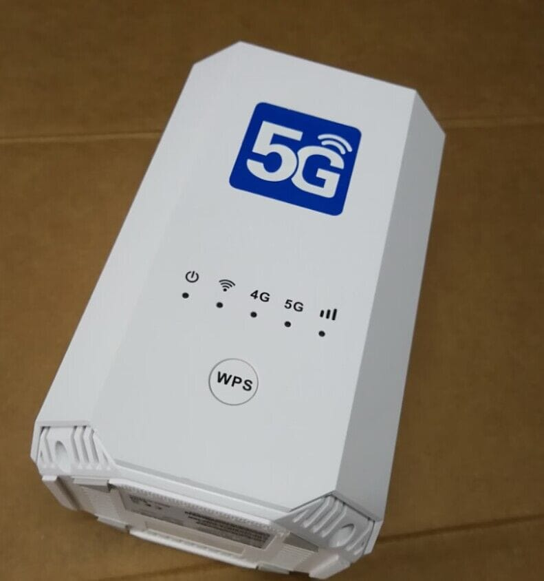
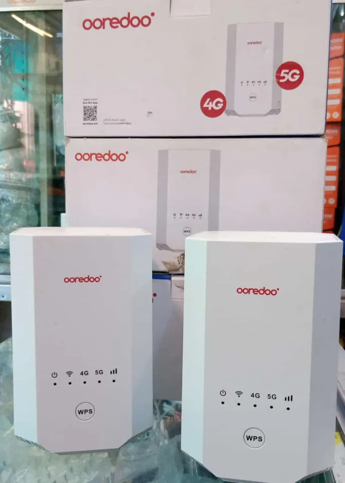

<!-- README.md -->

# 🔓 ZLT X28 | Unlock & Custom Admin Panel Solutions

---

### ✨ Unlock the Full Potential of Your ZLT X28 Modem

  

We offer a **complete solution** for the ZLT X28 modem — from **network unlocking** to building a **custom admin panel** with your own branding. Whether you're an individual user or a reseller, our tools and services will give you full control over your device.

---

### ✅ What We Offer

- 🔓 **Network Unlocking** – Use any SIM card from any network  
- 🔧 **Admin Panel Access** – Gain full administrative control  
- 🛠 **Firmware Updates & Upgrades** – Stay secure and up to date  
- 🎨 **Custom Admin UI** – Tailored with your logo, colors, and theme  
- 📦 **Bulk & Individual Packages** – Flexible options for all needs  
- 🎓 **Guided Training** – Step-by-step instructions included  

---

### 📊 Device Details

| Model    | Software Version |
|----------|------------------|
| ZLT X28  | 1.5.13           |

---

### 📞 Get in Touch

📬 **Telegram**: [@x28_zlt_unlock](https://t.me/x28_zlt_unlock)

---

<table width="100%">
  <tr>
    <td width="50%">
      
    </td>
    <td width="50%">
      
    </td>
  </tr>
</table>

---

### 🏷️ Tags

`#ZLT_X28` `#ModemUnlock` `#CustomAdminPanel` `#FirmwareUpgrade`  
`#4GModem` `#NetworkUnlock` `#ZLTAdminAccess` `#ModemBranding`
